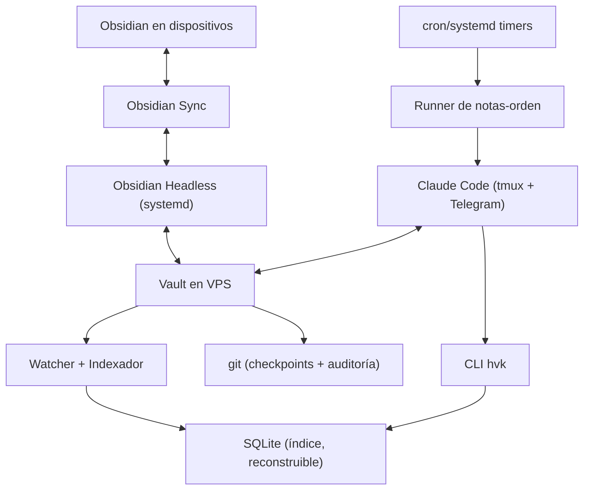

# Plan de implementación v2 — headless-vault-kit

> Sistema agéntico 24/7 sobre un vault de Obsidian en VPS, sin interfaz gráfica, replicando los **datos** que Obsidian deriva al abrirse — no su runtime.

**Estado del documento:** plan de implementación v2, sustituye operativamente al v1 ("Vault Gateway Headless")
**Fecha:** 2026-08-14 · revisado 2026-08-21 con los datos del inventario · 2026-08-23 con las Fases 4 y 5 hechas y las decisiones 5 y 6 cerradas
**Versión:** 2.4
**Hardware objetivo:** VPS Linux, 2 núcleos, 12 GB RAM
**Naturaleza:** el v1 se conserva como mapa de máximos; este documento define lo que se construye de verdad y en qué orden

---

## 1. Qué cambia respecto al v1 y por qué

El v1 diseñaba una plataforma de producto: gateway REST/MCP propio, cola de trabajos con leasing, adaptadores multiagente, matriz de CI en tres sistemas operativos, suite de compatibilidad. Todo correcto como diseño, pero con un coste de meses antes del primer valor real, para un usuario inicial de uno.

El v2 parte de dos observaciones que el v1 no explotaba:

1. **Claude Code ya es el gateway.** Lectura/escritura de archivos, búsqueda, permisos por rutas y herramientas, hooks, skills, MCP, subagentes y canal Telegram ya existen y están mantenidos por Anthropic. Construir un gateway propio debajo replica lo que el harness del agente ya da por arriba.
2. **Lo que se pierde sin la app son datos derivados, no magia.** El metadata cache de Obsidian (enlaces, backlinks, tags, tareas, propiedades) es estado 100 % reconstruible desde los archivos. Los plugins que importan para un flujo agéntico guardan su estado en formatos parseables (`.md`, `.base`, `.canvas`, YAML). Se replican los formatos, no el código.

| Pieza v1 | Decisión v2 |
|---|---|
| Gateway REST + OpenAPI + SDK | Eliminado. Claude Code + CLI del índice cubren el caso de uso |
| Servidor MCP propio como núcleo | Pospuesto a fase final, como capa fina sobre el índice |
| Cola SQLite con leasing, heartbeat, dead-letter | Sustituida por **el vault como cola** (notas-orden con estado en frontmatter) |
| Adaptadores Claude/Codex/Hermes | Innecesarios: la neutralidad la dan los formatos (Markdown, YAML, SQLite), no un gateway |
| Exclusión total de plugins | Sustituida por el **modelo de 3 niveles** (§3): se replican formatos de archivo, nunca runtime |
| CI en Linux/macOS/Windows | Solo Linux (el servidor). Los clientes siguen usando Obsidian normal en sus dispositivos |
| 13 fases, 3 MVP, meses | 8 fases; cada una entrega algo usable en días |

**Lo que se conserva del v1 como principios:** vault como fuente canónica, mínimo privilegio, idempotencia, papelera antes que borrado, contenido del vault como entrada no confiable, entrega incremental, compatibilidad explícita (documentar diferencias, no fingir equivalencia).

---

## 2. Objetivo y criterios de éxito

Disponer de un vault de Obsidian operativo 24/7 en el VPS —sincronizado, indexado y accesible
por Telegram— donde el agente:

- trabaja sobre el vault sincronizado con Obsidian Sync (via Obsidian Headless),
- consulta backlinks, tags, tareas, propiedades y texto **sin gastar tokens en leer archivos uno a uno** (el papel que cumplía Obsidian CLI con la app abierta),
- ejecuta consultas tipo Dataview y Bases sin la app,
- procesa notas-orden creadas desde cualquier dispositivo,
- mantiene vistas materializadas visibles desde el móvil,
- opera con permisos acotados, auditoría vía git y recuperación probada.

| Indicador | Objetivo | Medido (2026-08-21) |
|---|---:|---|
| Mensaje Telegram → respuesta del agente | Funciona 24/7, sobrevive a reinicios | Pendiente de la Fase 0 |
| Reconstrucción completa del índice (vault ~10k notas) | < 60 s | ✅ **4,9 s** en Linux |
| Actualización incremental tras sync | < 5 s | ✅ **0,34 s**, o 0,19 s dirigida |
| Consulta al índice (backlinks, tags, búsqueda) | < 100 ms | ✅ **0,5 – 35 ms** |
| Nota-orden creada en el móvil | Ejecutada exactamente una vez | Pendiente de la Fase 5 |
| Bucles sync ↔ agente | 0 | Regla dura implementada (ADR-0002); sin probar en producción |
| Restauración desde backup | Ensayada y documentada | Pendiente de la Fase 6 |
| RAM total del stack (Headless + índice + Claude Code) | Holgada en 12 GB | Sin medir: no hay VPS todavía |

---

## 3. Modelo de tres niveles (criterio de alcance)

Es la decisión central del v2: qué se replica, con qué profundidad y dónde se corta.

### Nivel 0 — Comportamiento natural de la app. Soporte total y exacto.

Lo que Obsidian deriva de los archivos al construir su metadata cache:

- Frontmatter (propiedades tipadas), tags inline y de frontmatter, alias.
- Encabezados y bloques (`^id`).
- Wikilinks, enlaces Markdown, embeds; resolución según `.obsidian/app.json`.
- Backlinks derivados y enlaces no resueltos.
- Tareas (checkboxes) con estado y posición.
- Búsqueda por texto, ruta y metadatos.

Universal (todo vault lo tiene sin configurar nada), definido por la sintaxis de los archivos, estable. **Este nivel es el producto.**

### Nivel 1 — Plugins propios de Obsidian. Soporte completo de sus formatos.

- **Bases** (`.base`): YAML puro. Interpretar filtros, fórmulas y vistas del subconjunto documentado. Apuesta estratégica: Obsidian empuja Bases como sustituto oficial de Dataview.
- **Canvas** (`.canvas`): JSON Canvas, lectura y escritura.
- Plantillas core y notas periódicas: creación por script/skill.
- Propiedades y marcadores: archivos de configuración legibles.

No es replicar comportamiento de terceros: son especificaciones publicadas por el propio Obsidian.

### Nivel 2 — Plugins de comunidad. Soporte selectivo + extensibilidad.

Criterio de admisión al núcleo (deben cumplirse ambos):

1. Estar entre los más instalados.
2. Su estado vive en archivos con sintaxis parseable (no en memoria ni en JS arbitrario).

Lista inicial: **Dataview** (subconjunto DQL + campos inline `clave:: valor`; DataviewJS explícitamente fuera), **Tasks** (sintaxis de fechas/prioridades y queries), **Kanban** (tableros = Markdown), **obsidian-git** (no se replica: se sustituye por git real en el servidor).

Para el resto del universo de plugins, la respuesta no es "lo soportamos" sino "**el sistema es extensible**": el indexador expone una interfaz de parser por plugin (entrada: archivo + metadatos; salida: filas para el índice y/o comandos de consulta). Cualquier miembro de la comunidad aporta el adaptador de su plugin en ~100 líneas sin tocar el núcleo.

### Fuera de alcance permanente

Ejecutar código de plugins, DOM/vistas/paleta de comandos, `app` de Obsidian, archivo activo en pantalla, emular Obsidian Sync. Idéntico al v1 en esto: sin pantalla no hay UI que replicar, y no se finge lo contrario.

---

## 4. Arquitectura objetivo



Componentes y su coste real:

| Componente | Qué es | Persistencia |
|---|---|---|
| Obsidian Headless | Sync oficial, servicio systemd (Fase 0) | Config propia |
| Watcher + Indexador | Un proceso pequeño: escaneo inicial + eventos de archivo | SQLite, **fuera del vault** y reconstruible |
| CLI `hvk` | Consultas: search, backlinks, links, tags, tasks, props, orphans, base | Ninguna |
| Claude Code | Harness: permisos, hooks, skills, Telegram, MCP | `~/.claude` |
| Runner de notas-orden | Script de ~100 líneas disparado por cron/watcher | El estado vive en el frontmatter de cada nota-orden |
| git | Auto-commit periódico: checkpoint, auditoría y recuperación | Repo local (remoto opcional) |

El índice y la base de datos viven fuera del vault —en
`${XDG_DATA_HOME:-~/.local/share}/hvk/<vault>-<hash8>/`, una carpeta por vault, según la
[ADR-0002](../docs/adr/0002-index-location.md)— para que Sync jamás los toque y ningún
watcher se dispare por ellos.

---

## 5. Fases

### Fase 0 — Base operativa (medio día)

El setup que ya funciona para otros, sin inventar nada:

- Obsidian Headless como servicio systemd (`ob sync --continuous`), con carpetas privadas excluidas **antes** del primer sync (`_PRIVADA`, `_SCRIPTS`, y las mismas exclusiones en todos los clientes).
- Claude Code en tmux con el plugin de Telegram, levantado por systemd (`hvk-agent.service`) con `EnvironmentFile` para tokens.
- Firewall: solo SSH. Nada expuesto a Internet.
- `git init` en el vault + auto-commit por cron cada 30 min (checkpoint, auditoría y recuperación en una sola pieza). `.gitignore` para `.obsidian/workspace*` y temporales.
- Prueba de fuego: `sudo reboot` y todo vuelve solo.

**Criterios de salida:** nota creada en el móvil visible en el VPS en segundos; mensaje a Telegram respondido; reinicio sin intervención manual; `git log` muestra los cambios del día.

### Fase 1 — Inventario del vault ✅ HECHA (2026-08-21)

Ejecutada sobre una copia del vault real, excluyendo `_PRIVATE/`, `.git/`, `.trash/` y
`workspace*`. El vault de producción no se tocó.

**Resultado, y no es el que este plan suponía:**

| Qué | Dato |
|---|---|
| Tamaño | 273 notas, 270 adjuntos, 22 MB |
| **Plugins de comunidad** | **Ninguno.** No existe `community-plugins.json` ni la carpeta `plugins/` |
| Plugins core relevantes | `bases`, `canvas`, `daily-notes`, `templates`, `sync`, backlinks, tags |
| Wikilinks | 265 en 105 notas |
| Embeds de adjunto | 544 en 75 notas |
| Tareas (checkbox) | 175 en 17 notas |
| Frontmatter | 36 claves distintas, buena parte con tildes |
| Archivos `.base` | **1** |
| Bloques ` ```dataview ` | **2, en una sola nota**, ambos `TABLE … FROM "carpeta" SORT … ASC` sin `WHERE` |
| Bloques ` ```dataviewjs `, ` ```tasks ` | **0** |
| Archivos `.canvas` | **0** |
| Campos inline `clave::`, sintaxis del plugin Tasks, Templater `<% %>` | **0 de cada** |
| Referencias de bloque `^id` | **0** |
| Rarezas | 24 notas con encabezados duplicados; 1 frontmatter YAML inválido; 9 enlaces rotos |

Dos consecuencias que este plan no anticipaba:

1. **Sin plugins de comunidad, el Nivel 2 no tiene usuarios en este vault.** Dataview no está
   instalado, así que sus dos bloques ni siquiera se renderizan hoy: son código muerto.
2. **Los formatos de Nivel 1 pendientes tampoco los tiene:** cero `.canvas`, y la carpeta de
   plantillas que declara `templates.json` no existe.

Lo que sí tiene usuarios masivos es el Nivel 0 —enlaces, tareas, frontmatter, búsqueda— y
Bases, que es justo lo que ya está construido.

**Criterio de salida cumplido:** hay una lista finita de usos reales, y las fases 3 y 4 se
re-priorizan abajo con esos datos en vez de con suposiciones.

### Fase 2 — Indexador Nivel 0 (la primera pieza de valor, 1–2 semanas)

Un solo proceso, sin frameworks:

- **Escaneo inicial:** recorre el vault comparando mtime + hash contra SQLite; solo reparsea lo cambiado (mismo patrón que el cache persistente de Obsidian).
- **Incremental:** watcher de filesystem con debounce y comprobación de estabilidad (los archivos que Headless está escribiendo se esperan). Exclusiones: `.git`, `.obsidian/workspace*`, `.trash`, carpeta del índice.
- **Verificación nocturna:** re-escaneo completo como red de seguridad (cron).
- **Parsing:** frontmatter (YAML), tags, alias, encabezados, bloques, wikilinks/enlaces/embeds con resolución según `app.json`, tareas, campos inline `clave:: valor` (ya preparando Dataview), texto completo en FTS5.
- **CLI `hvk`** con salida JSON y tabla:

```text
hvk search "consulta"          # FTS + filtros path:/tag:/prop:
hvk backlinks "Nota.md"
hvk links "Nota.md" [--broken]
hvk tags [--count]
hvk props --where "estado=abierto"
hvk tasks [--pending] [--due-before 2026-09-01]
hvk orphans
hvk rebuild                    # reconstrucción completa determinista
```

Esta CLI es lo que el agente usa en vez de leer archivos a lo bruto: **el sustituto directo del Obsidian CLI + app abierta, y el ahorro de tokens que buscaba el curso.** Una skill de Claude Code documenta cuándo usar cada comando.

**Criterios de salida:** borrar la BD y reconstruir produce el mismo resultado lógico; consultas < 100 ms; escaneo completo < 60 s; el agente responde "¿qué notas enlazan a X?" por Telegram sin abrir un solo archivo.

**Decisión técnica a tomar aquí (ADR corta):** Python (watchdog + sqlite3, cero build) frente a TypeScript (chokidar + better-sqlite3, mejor para futuro MCP). Ambas válidas en 2 núcleos; se decide y se documenta, no se debate eternamente.

### Fase 3 — Nivel 1: formatos oficiales (re-priorizada tras el inventario)

- **Bases** ✅ **hecho.** `.base` parseado y ejecutado contra el índice: filtros globales y por
  vista, fórmulas, `displayName`, orden, agrupación, límites y sumarios integrados. Salida
  como tabla Markdown o JSON. `hvk base "Archivo.base" [--view nombre] [--this ruta]`.
  El alcance exacto del lenguaje de expresiones está en la ADR-0005.
- **Canvas** — **pospuesto.** El vault tiene cero archivos `.canvas`. Se implementa cuando
  aparezca el primero, no antes: JSON Canvas es una especificación publicada y estable, así
  que esperar no cuesta nada y construir sin usuarios sí.
- **Plantillas y periódicas** — **bloqueado por una decisión, no por trabajo.** El vault no
  dice qué hacer: `templates.json` apunta a una carpeta que no existe, no hay
  `daily-notes.json`, y no se usa `{{date}}` en ninguna nota. Hay que decidir carpeta, formato
  de nombre y plantilla antes de escribir nada (Anexo, decisión 7).

**Criterios de salida:** un `.base` real del vault produce el mismo resultado que la app
(validación manual, pendiente de comparar las 26 filas que devuelve el único `.base`); la
diaria se crea desde el móvil (pendiente de la decisión 7 y de la Fase 0).

### Fase 4 — Vistas materializadas (Dataview degradado a opcional)

El inventario deshace el supuesto sobre el que se escribió esta fase: **no hay Dataview**, y
sus dos únicos bloques son `TABLE … FROM "carpeta" SORT … ASC` sin `WHERE`. Construir un
intérprete de DQL para eso serían semanas de trabajo para dos consultas que se reescriben como
un `.base` en diez minutos, o que ya responde `hvk props --where`.

- **Subconjunto DQL** — **pospuesto indefinidamente.** Se reactiva si aparece un vault (propio
  o de la comunidad) con uso real de Dataview. El motor de expresiones de Bases ya existe y
  sirve de base, así que el coste de empezar entonces es menor que el de empezar ahora.
- **Los dos bloques existentes se migran a Bases**, que es adonde Obsidian empuja de todas
  formas.
- **DataviewJS** sigue fuera, y ahora además sin usuarios: cero bloques.
- **Vistas materializadas — esta sí, y es la mitad valiosa de la fase.** Se construyen sobre
  **Bases**, no sobre DQL. Una nota marca su bloque generado:

```markdown
%% vista: base "000 BASE habilidades.base" vista "Tabla" cada 30m %%
<!-- vista:inicio -->
(contenido regenerado)
<!-- vista:fin -->
```

  Un cron regenera el contenido entre marcadores de forma idempotente. Resultado visible desde
  cualquier dispositivo, móvil incluido — algo que la app, que solo renderiza en pantalla, no
  ofrece. Y es la primera vez que el proyecto **escribe** en el vault, así que hereda las
  reglas de `CLAUDE.md`: escritura atómica, preservar frontmatter y finales de línea, papelera
  antes que borrado.

  ✅ **Hecho (2026-08-23).** La capa de escritura es `src/hvk/write.py` (ADR-0007) y las vistas
  son `hvk views [RUTA] [--apply]` (ADR-0008), con la sintaxis de arriba tal cual, más su
  equivalente en inglés. `cada 30m` se parsea pero no se obedece: honrar un intervalo exige
  estado, y todos los sitios donde guardarlo son o un diff permanente o algo que `hvk rebuild`
  tira. El cron decide la frecuencia.

**Criterios de salida:**

| Criterio | Estado |
|---|---|
| Regenerar dos veces sin cambios no produce diff | ✅ Verificado sobre `test-vaults/` y sobre una copia del espejo del vault real: el único `.base` da las mismas 26 filas del inventario y la segunda pasada deja el fichero byte a byte |
| Las vistas llegan al móvil vía Sync | Pendiente de ejecutar la Fase 0 en el VPS |
| Los dos bloques dataview del inventario están migrados a Bases | Pendiente: es una edición de las notas de Ángel, no del repositorio. La maquinaria que necesitan ya existe |

### Fase 5 — Automatización: el vault como cola (1 semana)

Sin cola SQLite, sin leasing: **el vault ya es la cola** y el frontmatter ya es el estado.

Nota-orden (simplificación del Anexo B del v1):

```markdown
---
tipo: orden
accion: revisar-documento
skill: revision-marco
estado: pendiente
entradas:
  - Marco/01-Marco-conceptual.md
salida: Informes/Revision-{{fecha}}.md
perfil_permisos: solo-revision
creada: 2026-08-14T10:00
---
Detecta contradicciones y lagunas. No modifiques las entradas.
```

Runner (script de ~100 líneas, cron cada minuto o watcher):

1. Busca en `Jobs/` notas con `estado: pendiente`.
2. Transición atómica a `estado: en-curso` + hash del contenido (idempotencia: si el runner muere y relanza, no repite lo hecho).
3. Lanza `claude -p` con la skill indicada y la configuración de permisos del perfil.
4. Escribe la salida, marca `estado: hecho` (o `fallido` con el error en el cuerpo) y añade log al pie de la nota.
5. Notifica por Telegram si la orden lo pide.

Anti-bucle (las reglas de idempotencia del v1, versión mínima): el runner solo vigila `Jobs/`; las carpetas de salida nunca disparan órdenes; los cambios de estado los hace el propio runner y los reconoce como suyos; Headless sincroniza la nota-orden con su estado, así que desde el móvil ves el progreso en la propia nota.

A esto se suma el **scheduler trivial**: cron con `claude -p` para tareas periódicas (resumen matinal a Telegram, procesado del inbox, regeneración de vistas). N8N puede seguir siendo el disparador externo (webhooks de terceros → crea una nota-orden), sin acoplarse a nada más.

✅ **Hecha (2026-08-23)** como `hvk jobs` (ADR-0009), con dos desviaciones del plan que la ADR
justifica: es un subcomando del CLI y no un script en `runner/`, para no duplicar la
localización del vault, la capa de escritura ni los tests; y **ni la carpeta de órdenes ni la
de perfiles tienen valor por defecto** — `Jobs/` era vocabulario de un vault concreto, y un
runner que arranca porque una carpeta se llamaba de cierta forma es justo el fallo a evitar.
Además, todo trabajo **debe** nombrar un perfil de permisos: eso adelanta la parte barata de la
Fase 6, porque ejecutar un agente sin límites declarados no puede ser el comportamiento por
defecto ni durante una fase.

**Criterios de salida:**

| Criterio | Estado |
|---|---|
| Se ejecuta exactamente una vez | ✅ El reclamo es una escritura que declara el hash leído; dos runners en carrera, o uno reiniciado, pierden la carrera en vez de repetir |
| Un fallo deja `estado: fallido` con causa legible | ✅ En el frontmatter y en una línea al pie de la propia nota |
| Ningún cambio del agente re-dispara órdenes | ✅ Solo se vigila la carpeta declarada, y una salida dentro de ella se rechaza |
| El estado es visible en el propio vault | ✅ Es el frontmatter de la nota |
| Creada **desde el móvil**, y aviso por Telegram | Pendiente de la Fase 0: son transporte y credenciales, no lógica |

### Fase 6 — Harness de seguridad y operación (1 semana)

Con los medios nativos de Claude Code, no con un motor de políticas propio:

- **Permisos:** `settings.json` del vault con allow/deny por herramienta y ruta (deny de borrado directo, deny fuera del vault, escritura acotada a carpetas de salida por perfil). Perfiles distintos para sesión interactiva de Telegram y para el runner.
- **Hooks:** PreToolUse para forzar papelera (`.trash/`) en vez de borrado y bloquear rutas sensibles (`_PRIVADA`).
- **Prompt injection:** el contenido del vault se trata como datos, nunca como instrucciones — las skills lo dicen explícitamente; las órdenes ejecutan con el perfil mínimo; toda acción destructiva o masiva requiere confirmación por Telegram (el agente pregunta antes, no después).
- **Operación:** healthcheck por cron (Headless vivo, retraso de sync, índice al día, disco) con aviso a Telegram si algo cae; backup diario del vault fuera del VPS y **restore ensayado una vez** en carpeta alternativa; rotación básica de logs.

**Criterios de salida:** un intento de escribir fuera de las rutas permitidas se bloquea y queda registrado; la caída de Headless llega a Telegram en minutos; el restore está documentado y probado.

### Fase 7 — Comunidad (opcional, cuando el sistema lleve semanas estable)

Aquí se recupera lo mejor del espíritu del v1, ya con evidencia:

- **Servidor MCP** como capa fina sobre el índice (mismas consultas expuestas como tools). En este punto —y solo en este— vuelve la neutralidad multiagente: cualquier cliente MCP (Codex, Hermes, otro Claude) consulta el índice sin que exista un solo adaptador específico.
- **Interfaz de parsers** documentada + un adaptador de ejemplo, para que cada socio aporte el soporte de su plugin favorito.
- Empaquetado: repo público, script de instalación, docs de las fases 0–6 como guía reproducible para la comunidad (que es, en la práctica, la guía completa de «Obsidian agéntico en un VPS» que hoy no existe).

**Criterios de salida:** un segundo agente distinto de Claude consulta el índice vía MCP; al menos un adaptador escrito por alguien que no eres tú.

---

## 6. Esquema SQLite mínimo (referencia)

```sql
CREATE TABLE files    (id INTEGER PRIMARY KEY, path TEXT UNIQUE, type TEXT,
                       mtime INTEGER, size INTEGER, hash TEXT);
CREATE TABLE props    (file_id INT, key TEXT, value TEXT, value_type TEXT, inline INT);
CREATE TABLE tags     (file_id INT, tag TEXT, line INT);
CREATE TABLE headings (file_id INT, level INT, text TEXT, line INT);
CREATE TABLE blocks   (file_id INT, block_id TEXT, line INT);
CREATE TABLE links    (file_id INT, target_raw TEXT, target_file_id INT,  -- NULL = roto
                       kind TEXT, embed INT, line INT);
CREATE TABLE tasks    (file_id INT, text TEXT, status TEXT, line INT,
                       due TEXT, extra_json TEXT);
CREATE VIRTUAL TABLE fts USING fts5(path, title, body);
-- Backlinks = SELECT sobre links invertido: no se almacenan, se consultan.
```

Todo derivado, todo reconstruible: `DROP` + `hvk rebuild` debe dar el mismo resultado lógico siempre.

---

## 7. Riesgos

| Riesgo | Mitigación |
|---|---|
| Headless en beta (cambios, fallos de sync) | Encapsulado como sincronizador puro; systemd lo reinicia; el healthcheck avisa; el resto del sistema no depende de su API |
| Bucle sync → watcher → agente → sync | Exclusiones estrictas, debounce, el runner reconoce sus propios cambios, salidas nunca disparan órdenes |
| Prompt injection desde notas capturadas | Perfiles de permisos mínimos, hooks, confirmación Telegram para lo destructivo, contenido = datos |
| Corrupción/conflictos de escritura | Sync resuelve conflictos como siempre (el agente es "un dispositivo más"); git da recuperación; papelera antes que borrado |
| Divergencia semántica con Obsidian (enlaces ambiguos, DQL) | Validación manual contra la app en el inventario; diferencias documentadas, no maquilladas |
| Volver a la sobreingeniería | Cada fase entrega valor usable en días; nada de la Fase 7 se toca antes de semanas de estabilidad |

---

## 8. Qué se pospone del v1 y qué lo reactivaría

| Pieza v1 | Condición de reactivación |
|---|---|
| REST/OpenAPI + SDK | Aparece un cliente real que no hable MCP ni CLI |
| Cola con leasing y dead-letter | Volumen de órdenes o concurrencia que el frontmatter no gestione (decenas simultáneas) |
| Adaptadores multiagente | Un segundo agente en uso real; primero se resuelve vía MCP (Fase 7) |
| Compatibilidad Local REST API / Obsidian CLI | Demanda concreta de migración en la comunidad |
| Bridge de escritorio | Necesidad real de `obsidian://` o contexto activo; hasta entonces, no |
| Multiusuario, OIDC/mTLS | Más de una persona operando el mismo sistema |

El v1 no se tira: es el plano de a dónde puede crecer esto si alguna de esas condiciones se cumple. Las ADR cortas (una página) siguen siendo obligatorias para cada decisión de las fases 2–7.

---

## 9. Orden real de ejecución (revisado 2026-08-21)

El plan se escribió suponiendo Fase 0 primero. En la práctica se hizo al revés: las fases 1 y 2
se desarrollaron en local contra vaults sintéticos, porque no necesitan servidor. Estado a
2026-08-21:

| Fase | Estado |
|---|---|
| 1 · Inventario | ✅ Hecha |
| 2 · Indexador Nivel 0 + CLI | ✅ Hecha salvo la demo por Telegram, que depende de la Fase 0 |
| 3 · Nivel 1 | Bases ✅ · Canvas pospuesto (sin usuarios) · plantillas bloqueadas por la decisión 7 |
| 0 · Base operativa | ✅ **La mitad que se construye**: `deploy/` con units de usuario, cron y runbook (ADR-0006), verificado en contenedor Debian 12 incluida la prueba de reinicio. Falta **ejecutarlo en el VPS**, que es trabajo de Ángel |
| 4 · Vistas materializadas | ✅ **Hecha** (2026-08-23), sobre la capa de escritura de ADR-0007. DQL sigue pospuesto |
| 5 · Notas-orden | ✅ **Hecha** (2026-08-23). Falta solo lo que depende de Sync y Telegram |
| 6–7 | Sin empezar |

**Lo siguiente es la Fase 6** (permisos reales, healthcheck, backup ensayado) o **ejecutar la
Fase 0 en el VPS**, y la segunda pesa más de lo que este plan suponía: hay ya cinco criterios
de salida abiertos en las fases 2, 4 y 5 que no son código, sino Sync y Telegram. Todo lo
demás de esas fases está construido y verificado.

Queda además **enchufar en `deploy/` los dos temporizadores** que hacen que lo construido corra
solo: `hvk views --apply` y `hvk jobs --run`. Ambos están documentados como línea de cron, pero
no tocan aún los scripts de despliegue, que se verifican en el contenedor.

Y una deuda que la ADR-0009 nombra y no resuelve: el runner comprueba que un perfil de permisos
existe y está bien formado, no que **restrinja** algo. Hacer que los permisos sean reales es
trabajo de la Fase 6.

La ejecución de la Fase 0 en el VPS sigue pendiente y no bloquea nada de lo anterior: cierra el
último criterio de salida de la Fase 2 y hace que todo lo construido corra de verdad, pero se
puede seguir desarrollando mientras tanto.

### Primer ciclo recomendado, tal como se escribió (referencia histórica)

1. Fase 0 completa siguiendo la receta ya conocida (Headless systemd + Claude/Telegram + git auto-commit + prueba de reinicio).
2. Inventario del vault (Fase 1) — lo puede hacer el propio agente ya corriendo.
3. Vertical mínima de la Fase 2: escaneo inicial + `vault search` + `vault backlinks`, aunque sea sin watcher todavía.
4. Demostración de cierre: desde el móvil, crear una nota que enlaza a otra → verla llegar al VPS → preguntar por Telegram "¿qué notas enlazan a X?" → respuesta correcta en segundos, sin que el agente haya leído el vault entero.

Si esa demostración funciona, el resto del plan es acumular capas sobre algo que ya vive. Si algo falla ahí, se ha descubierto con dos días invertidos, no con dos meses.

---

## Anexo: decisiones pendientes (no asumir en silencio)

1. ~~Nombre del proyecto~~ — DECIDIDO (2026-08-14): **headless-vault-kit**, binario del CLI **`hvk`**.
2. ~~Python vs TypeScript para el indexador~~ — DECIDIDO (2026-08-21): **Python 3.11+**,
   instalado con `uv` ([ADR-0001](../docs/adr/0001-indexer-language.md)).
3. ~~Ubicación del índice y exclusiones~~ — DECIDIDO (2026-08-21):
   `${XDG_DATA_HOME:-~/.local/share}/hvk/<vault>-<hash8>/`, una carpeta por vault
   ([ADR-0002](../docs/adr/0002-index-location.md)).
4. ~~Resolución de wikilinks ambiguos~~ — DECIDIDO (2026-08-21): regla propia, documentada, con
   la ambigüedad almacenada y consultable ([ADR-0003](../docs/adr/0003-link-resolution.md)).
   Corrige de paso el plan: `newLinkFormat` y `useMarkdownLinks` gobiernan cómo se **escriben**
   los enlaces, no cómo se leen.
5. ~~Git en el VPS: solo local, o remoto privado además del backup~~ — DECIDIDO (2026-08-21):
   **solo local, sin remoto** ([ADR-0006](../docs/adr/0006-deployment-leaves-the-system-alone.md)).
   Da checkpoints, auditoría y deshacer inmediato sin una clave de despliegue que gestionar ni
   un cron que falle por un corte de red. Sobrevivir a la pérdida del servidor es de la Fase 6.
6. ~~Licencia y modelo de publicación~~ — DECIDIDO (2026-08-23): **MIT**. Es la de menor
   fricción para que alguien pruebe esto y aporte un adaptador de parser (Fase 7), y las dos
   dependencias de ejecución ya son permisivas, así que no imponían nada. Se descartó
   Apache-2.0 —su concesión expresa de patentes no aporta casi nada a un programa que parsea
   ficheros Markdown— y AGPL, que protege un escenario, el SaaS cerrado, que aquí es
   improbable y que tampoco quitaría nada.

   **Consecuencia que conviene no olvidar:** mientras el autor sea único, conserva el copyright
   entero y puede relicenciar. Al aceptar el primer pull request de un tercero eso deja de ser
   cierto sin el permiso de cada contribuidor. Si alguna vez se quiere conservar esa opción,
   hay que pedir un CLA desde el principio.

   Publicar el repositorio publica también `.plans/` y `CLAUDE.md`, escritos en español y para
   uso interno. No hay nada sensible en ellos; que se publiquen o se retiren es una decisión
   aparte y todavía abierta.
7. **Plantillas y notas periódicas: carpeta, formato de nombre y plantilla.** Abierta, y
   bloquea esa parte de la Fase 3. El inventario confirma que el vault no lo dice —
   `templates.json` apunta a una carpeta inexistente, no hay `daily-notes.json` y no se usa
   `{{date}}` en ninguna nota—, así que hay que decidirlo desde cero. Es además la primera vez
   que el proyecto escribiría en el vault, lo que exige su propia ADR.
